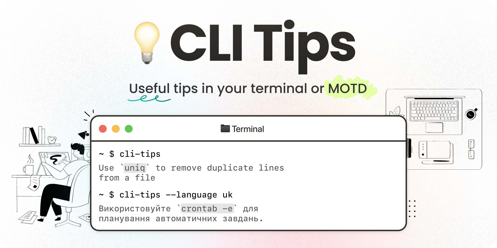

<!-- markdownlint-disable first-line-h1 no-inline-html -->

<div align="center">



<p>

`cli-tips` is a command-line tool that provides useful tips and commands for Linux users. It can be integrated as a **Message of the Day** (MOTD) to enhance your terminal experience.
</p>

</div>

## ✨ Features

- Displays helpful Linux command tips
- Supports multiple languages
- Easy to install and use

## 📥 Installation

To install `cli-tips`, run the following command:

```bash
curl -sL https://raw.githubusercontent.com/cli-stuff/cli-tips/refs/heads/main/install.sh | bash
```

<details>
<summary>
    <h4>🗑️ Uninstall</h4>
</summary>

To uninstall `cli-tips`, run the following command:

```bash
sudo rm -rf $PREFIX/usr/{bin,share}/cli-tips && hash -r
```

> [!NOTE]
> If you want to remove this tool from **Termux**, run the above command without `sudo`.
</details>

### Compatibility table

| <div></div> **Linux** | <div></div> **Termux** | <div></div> **macOS** | <div></div> **Windows** (on [msys shell](https://www.msys2.org/)) |
| :-: | :-: | :-: | :-: |
| ✅ | ✅ | N/A | N/A |

## 🚀 Usage

To print a random tip, run:

```bash
cli-tips

# Output:
# Use 'uniq' to remove duplicate lines from a file
```

> [!NOTE]
>
> `cli-tips` automatically detects the user's language and displays tips in that language. You can also set the language manually using the `LANG` environment variable.

### Use Another Language

To display tips in a different language, use the `--lang` option:

```bash
cli-tips --lang=uk
# Output: Використовуйте 'uniq', щоб видалити дубльовані рядки з файлу
```

You can also use the `LANG` environment variable:

```bash
LANG=de cli-tips
# Output: Verwenden Sie 'uniq', um doppelte Zeilen aus einer Datei zu entfernen
```

<!-- ### Specify a Custom Folder with Tips Translations

To use a custom folder with tips translations, set the `TIPS_FOLDER` environment variable:

```bash
TIPS_FOLDER=/path/to/tips cli-tips --lang=veryrarelanguage
# Output: <Tip in veryrarelanguage>
```

By default, `cli-tips` uses the built-in tips folder. The custom folder should contain text files in the following format:

```plaintext
tips_<lang_id>.txt
```

Example:

```plaintext
📂 translations/
 ├── 📄 tips_de.txt
 ├── 📄 tips_en.txt
 ├── 📄 tips_pl.txt
 └── 📄 tips_uk.txt
``` -->

## 📝 License

This project is fully free and you can do anything you want with it, even without mentioning this repository or license. Enjoy! 🚀
